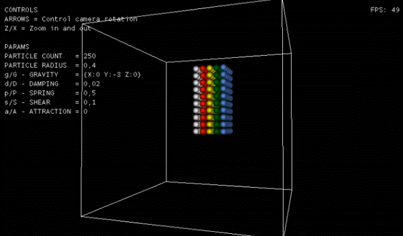
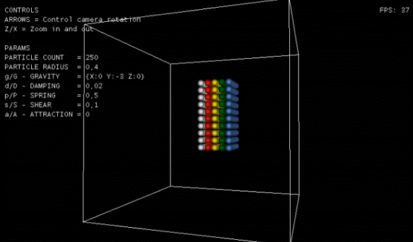

# XNA Particles

Simple demo showing a particle simulation system that handles particle motion and collision detection and response.
Highly based on the NVIDIA's CUDA particle demo.

The physics simulation is entirelly done on the CPU side, no GPU acceleration and no multi-threading architecture.
This is just a demo for testing the particle simulation algorithms.

Made for academic purposes only.

#### Normal configuration values

#### High particle attraction values

## Getting Started

### Dependencies

* XNA Framework

## Authors

Hugo 'HRuivo' Ruivo
[@HRuivo](https://github.com/HRuivo)

## Version History

* 1.1
    * Updated readme file with animated images
* 1.0
    * Initial Release from previous bitbucket repository
